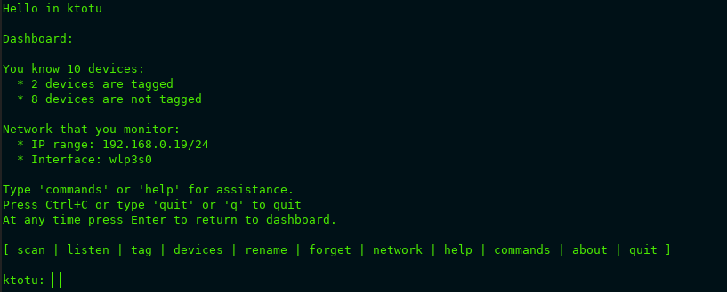

# `ktotu`

Command-line tool to tag devices in your network and monitor it against intruders

Version 0.1

## tl;dr
- Runs in terminal
- For Linux (possibly BSDs and macOS might work, not tested yet)
- Self-hosted and private
- Usable, but in early stage of development
- It's Free and Open Source Software - GNU GPL v2 license
- Network scanning requires `sudo`
- Early stage of application security - it's not yet ready for running on critical resources

## Table of contents
- [`ktotu`](#ktotu)
  - [tl;dr](#tldr)
  - [Table of contents](#table-of-contents)
  - [Typical use case](#typical-use-case)
  - [Download](#download)
  - [Install](#install)
    - [Run `install` script](#run-install-script)
    - [(Optional, recommended) Add `ktotu` file path to the `$PATH` variable](#optional-recommended-add-ktotu-file-path-to-the-path-variable)
      - [Open shell configuration file](#open-shell-configuration-file)
      - [Find `PATH` variable in this file. Paste the path to `ktotu` with `:` (colon) after it](#find-path-variable-in-this-file-paste-the-path-to-ktotu-with--colon-after-it)
      - [Save and close text editor](#save-and-close-text-editor)
      - [Execute shell configuration file](#execute-shell-configuration-file)
  - [Run](#run)
  - [Manual](#manual)
    - [How to use `ktotu`](#how-to-use-ktotu)
    - [Glossary](#glossary)
    - [Commands](#commands)
    - [Usage tips](#usage-tips)
    - [Technical description](#technical-description)
  - [Building from source code](#building-from-source-code)
    - [Prerequisities](#prerequisities)
    - [Build](#build)
    - [Build and install](#build-and-install)
  - [Privacy](#privacy)
  - [Security](#security)
  - [Roadmap](#roadmap)
  - [Dependencies](#dependencies)
  - [License](#license)
  - [About](#about)
    - [Name origin](#name-origin)
    - [Website](#website)
    - [Author](#author)

## Typical use case
0. Download `ktotu`
1. (Optional, recommended) Add `ktotu` to the `$PATH`
2. Install `./install`
3. Run `ktotu`
4. Run command `network` - configure network you want to monitor by providing network interface and IP range
5. Run command `scan` - find active devices in your network
6. Run command `tag` - tag devices by telling `ktotu` which device you disconnected, one device at a time. Repeat that for each device connected to your network
7. Run command `listen` - start monitoring your network
8. (Optional) Run command `help` or read this document to know more

## Download
Currently `ktotu` is not hosted as binary. You can build from source code on your own - it's very simple. See: [Building from source code](#building-from-source-code)

## Install
### Run `install` script
Go to folder with downloaded `ktotu` and run `./install`

If program doesn't run, make sure it is executable. You can make it executable with `chmod +x install` in folder with program.

### (Optional, recommended) Add `ktotu` file path to the `$PATH` variable
`ktotu` is now installed under `/opt/ktotu/` folder and has symlink from `/usr/local/bin`. 

It's possible that `/usr/local/bin` is already in your `$PATH` variable. You can check it running `echo $PATH | grep /usr/local/bin`. If it's there, you can skip this section. If not, please continue

#### Open shell configuration file
It's `.bashrc`, `.zshrc` or other appropriate for your shell. In docs I assume it's `.bashrc`. You will find the configuration file in your user's folder - `/home/{your-user-name}/.bashrc`

Use your favourite text editor and open it (for example `nano ~/.bashrc` or `vim ~/.bashrc`)

#### Find `PATH` variable in this file. Paste the path to `ktotu` with `:` (colon) after it
`export PATH=/usr/local/bin/ktotu:$PATH`

#### Save and close text editor

#### Execute shell configuration file
Run `source ~/.bashrc`

## Run
If it's added to `$PATH`, simply type `ktotu` to run the program from anywhere in the system

If no `ktotu` in `$PATH`, then navigate to folder with the program and run it using `./ktotu`

If program doesn't run, make sure it is executable. You can make it executable with `chmod +x ktotu` in folder with the program

## Manual
### How to use `ktotu`

`ktotu: network` (or just `ktotu: n` as a shorthand - for most of the commands you can type just a first letter) - Decide which network you want to monitor and provide the network interface and IP range to `ktotu`

You can find your current interfaces and IP ranges using `ip a` and `nmcli d`. Interface might look like `wlp1s0` and IP range like `192.168.0.0/24`.

`ktotu: scan` (shorthand - `ktotu: s`) - Then, you can find devices in your network. This way you will discover connected devices and their MAC addresses. `ktotu` uses MAC addresses of devices to distinguish one from another.

In next step, you will assign names to these devices. In order to distinguish expected devices - like your smartphone or laptop - from intruders, it's highly recommended to tag your devices.

You can tag devices in two ways. You can manually assign name using `rename` command or interactively discover device using `tag` command.

`ktotu: rename` (shorthand - `ktotu: r`) - Sometimes you can discover MAC address of your device by simply reading it in, for example, smartphone's settings.

If you know your device's MAC address, you can assign the name to the MAC address using 'rename' command.

If your device is not visible on the devices list displayed after running `rename`, connect your device to monitored network and run `scan`.

You can always check list of tagged and untagged devices running `devices` (shorthand - `ktotu: d`) or `macs` (shorthand - `ktotu: m`) if you need list of MAC addresses only.

`ktotu: tag` (shorthand - `ktotu: t`) - Alternatively you can run `tag` command. It's a simple  procedure: 

1. `ktotu` performs scan for active devices
2. When it's done, it knows MAC addresses of devices in your network. But it doesn't know which device holds which MAC address
3. To discover it, decide which device you want to `tag`
4. Once you decided, disconnect that device from the network
5. Make sure it's disconnected before you proceed to the next step
6. Provide a name of this device, for example `My Smartphone`
7. `ktotu` performs the second scan for active devices
8.  Once it's done, `ktotu` checks which device disappeared from the network and assigns the provided name to its' MAC address
9.  Your device is now tagged

Once you tag all devices used in your network, you will fully benefit from using `ktotu` by monitoring your network with `listen` command. You will immediately recognize intruders and exactly know who and when is connected

`ktotu: listen` - now you're ready to start monitoring your network. In `listen` panel, you will be alerted about intruders and see currently connected devices to your network

`ktotu: dashboard` - main menu with summary of devices and network. You can open it using command `dashboard` or pressing Enter

### Glossary

Types of devices:

- tagged - has an assigned name and MAC address
- untagged - has MAC address, but has no name yet
- unknown - never seen before

Any device is unknown until it's connected to your network and found by `ktotu` either `listen` during monitoring or on single `scan`

### Commands

`network` (shorthand `n`) - configure IP range and interface which you want to monitor

`dashboard` - see devices and network summary. As an alternative to typing the command, you can press Enter to open it

`scan` (shorthand `n`) - finds all devices connected to your network. Once `ktotu` finds a new device, saves it and device becomes untagged

`tag` (shorthand `t`) - to recognize untagged devices, you can use `tag` command. Once you tag the device, it becomes tagged and it's easier to track during `listen`

`listen` (shorthand `l`) - constantly repeat scan, alert about unknown devices

`devices` (shorthand `d`) - see tagged and untagged devices

`macs` (shorthand `m`) - see only MAC addresses of tagged and untagged devices

`forget` (shorthand `f`) - make device unknown to `ktotu`, if you want so

`rename` (shorthand `r`) - change name of device or tag it by MAC address.

`help` (shorthand `h`) - help page

`about` (shorthand `a`) - info about `ktotu`

`quit` or `Ctrl+C` (shorthand `q`) - close `ktotu`

### Usage tips

You can use `ktotu` in two ways:

- Interactive - simply start program using `ktotu` command 
- Single command - type `ktotu` with command that you want to execute and optionally with parameters. Examples: `ktotu scan` or `ktotu f 2`

You can type only first letter of command as well, for example `t` for `tag` or `r` for `rename` command. `d` is `devices`

At any time press Enter to return to dashboard.

### Technical description

Devices and network data is stored in `/home/{your_username}/.ktotu`

`ktotu` is installed in `/opt/ktotu`

Along with `ktotu`, there is `mac_addresses_scanner` in the same location - `/opt/ktotu`

`ktotu` has symlink from `/usr/local/bin/ktotu`

Performing scan requires `sudo`, in order to run `/opt/ktotu/mac_addresses_scanner`

## Building from source code
You can build `ktotu` from the source.

### Prerequisities
- Download source code from official repository - https://gitlab.com/jmaczan/ktotu
- Python 3
- pip3
- Debian-based Linux (build scripts use `apt`, but you can modify this to your own needs - build scripts are simple `bash` commands)

### Build
Inside folder with source code, run script `./build-from-source.sh`

Output files will appear in folder `dist/`

Navigate to it `cd dist/` and run `./install` script

### Build and install
You can both build and install using single script `./build-and-install.sh`

## Privacy
`ktotu` is a private program. It works locally on your machine and doesn't connect with any external service. It doesn't even need Internet connection to work - you can use it for local-only networks as well. 

`ktotu` doesn't collect any data about usage, telemetry and so on.

It stores all used data on your machine locally under `/home/{your-user-name}/.ktotu` and data which is stored is necessary for `ktotu` to operate - data about devices (MAC addresses and names that you assign to them) and network settings (interface and IP range).

## Security
Purpose of `ktotu` is to increase your security through helping you to recognize your devices and monitor for the unknown ones. 

Source code of `ktotu` uses minimal amount of dependencies - currently it's only single Python package `python3-scapy`. 

`ktotu` is on early stage of development and it might have security issues. Eliminating potential vulnerabilities is one of top priorities in development roadmap.

I encourage all of you to read the source code and try to hack `ktotu`. I will be grateful for your contribution in application security.

## Roadmap
- CI/CD build that produces binary artifact
- Faster and more accurate scanning
- User's input sanitization
- Security audit of `ktotu`
- Graceful exit on `Ctrl+C` during scanning
- Allow for configuring multiple networks
- Import / export devices and network data
- Handle gracefully more non-happy path scenarios, like user's invalid input
- Allow for running custom script when unknown device is found
- Allow to stop to `listen` without exiting the program
- Unix-based multiplatform - test and build on BSDs and macOS
- Encrypt stored data about devices and network

## Dependencies
This project is written in Python 3 and uses `python3-scapy` package. Scapy is released under GNU General Public License v2

## License
GNU General Public License v2

## About
### Name origin
In Polish language "kto tu (jest)?" means "who (is) here?"

### Website
https://maczan.pl/ktotu

### Author
Made in Poland in 2021 by [Jedrzej Pawel Maczan](https://maczan.pl/)